# DAPPS # Solidity #Truffle

Aqui se realizara una conexion entre Ganache y Metamask mediante una aplicacion web de React y el Solidity con el que ya contamos del ejercicio anterior. 

NOTA: link para descargar Ganache https://www.trufflesuite.com/ganache

PASO - 1

Una vez instalado y abierto Ganache seleccionamos cualquier address, la copiamos y pegamos dentro de nuestro deploy y guardamos.

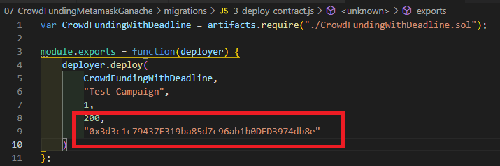

Ahora pasamos a nuestro cmd y ejecutamos el comando "truffle migrate --network genache --reset" con lo que se compilaran, ejecutaran y transferiran a Ganache nuestros contratos que tenemos creados, mostrandonos su informacion correspondiente, siendo esto importante observar y anotar en algun lado la "contact address".

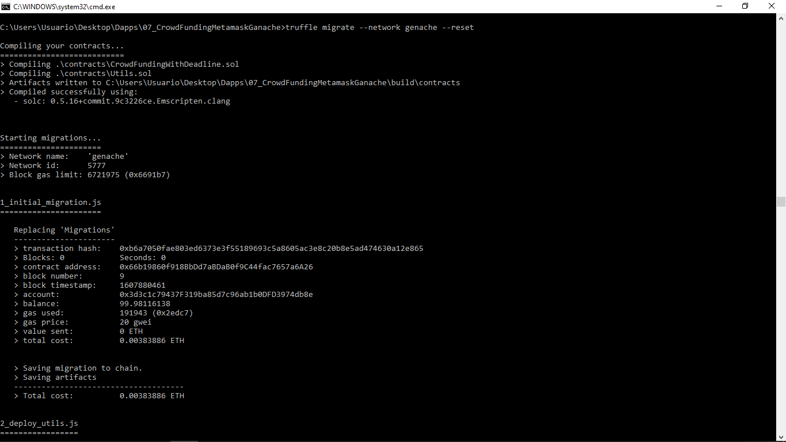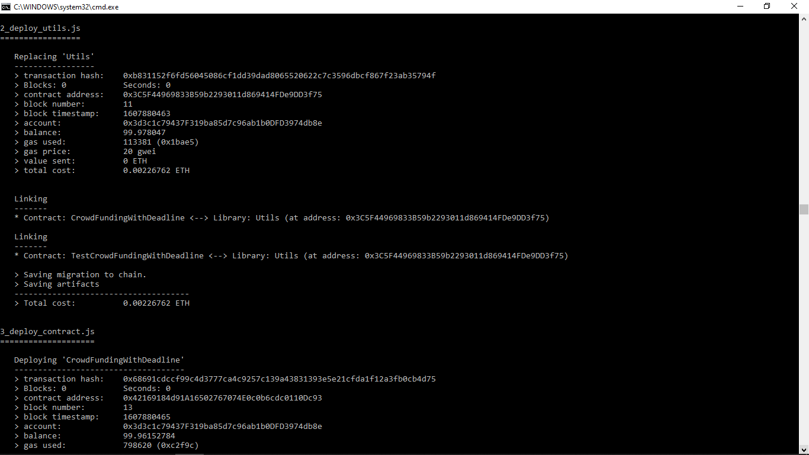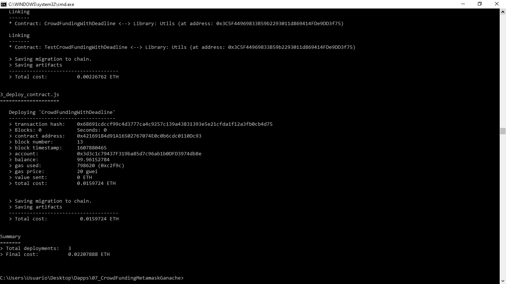

Una vez que los ejecutamos, veremos como en Ganache nos descuenta el Eth correspondiente para la creacion de los contratos, si no desconto nada, habria que revisar los contratos.

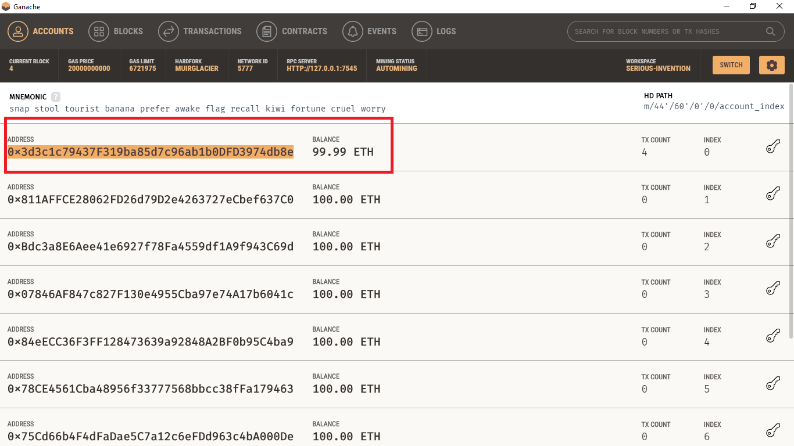

Ahora nos dirigimos a Transacciones y buscamos la transaccion que tenga la contact address de nuestro deploy.

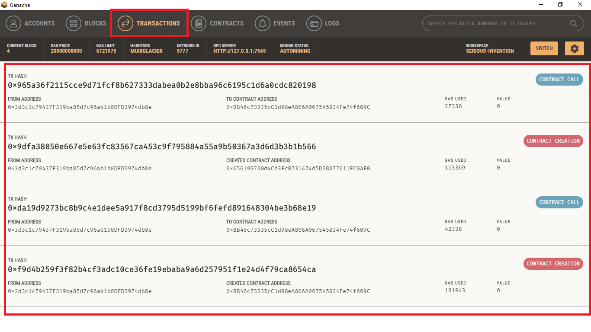

Tambien vincularemos nuestro contrato de ganache con metamask, por lo que crearemos un RPC personalizado, para esto en ganache seleccionamos la frase que se encuentra en mnemonic (son 12 palabras), las copiamos y una vez en metamask damos clic en  "importar usando la frase semilla de la cuenta", una vez ahi simplemente pegamos lo que tenemos copiado del mnemonic de ganache, asignamos una contraseña cual sea y listo.

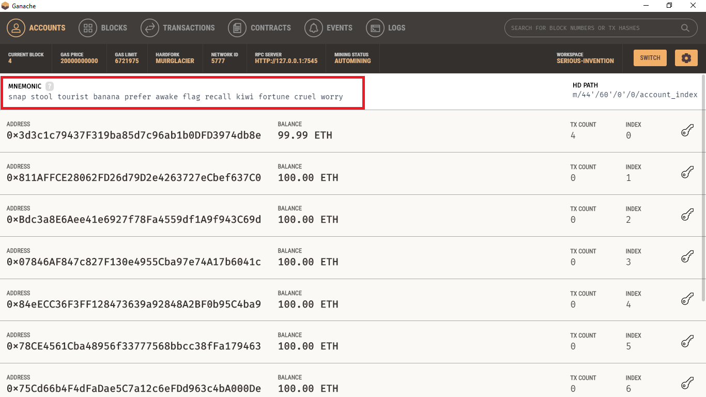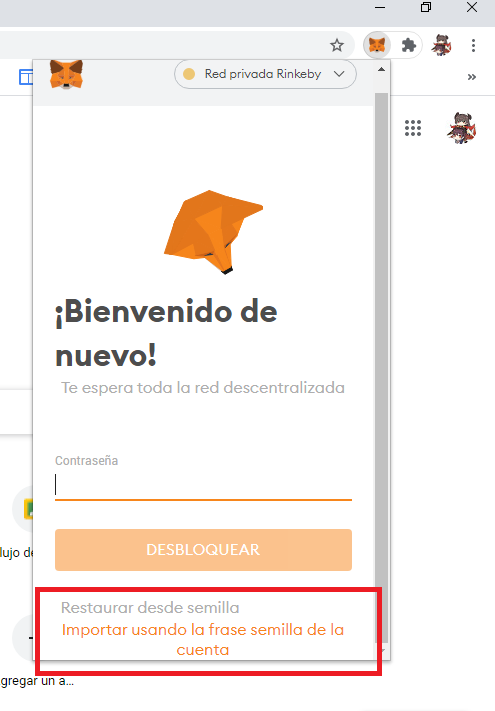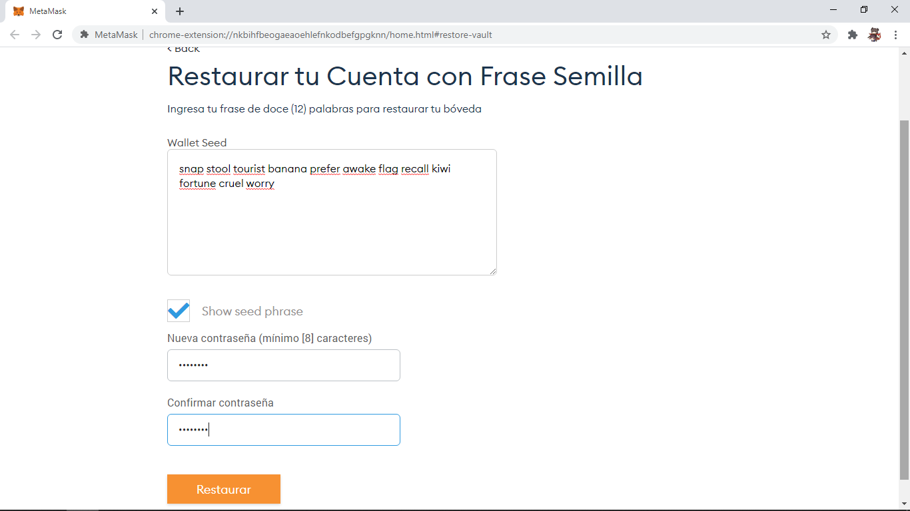

Ahora pasamos a configurar y crear nuestra propia RPC privada de ganache, entramos a RPC Custom y nos pedira que llenemos la informacion de rpc, chainid y nombre de la red, para el caso del rpc lo copiamos directamente de ganache donde dice "rpc server", en el caso de la chainid usaremos la id que se maneja por default para las redes privadas (mas informacion de ChainID aqui: https://github.com/ethereum/EIPs/blob/master/EIPS/eip-155.md) y el nombre de la red que nos mostro el cmd (de igual manera puede ser el nombre que nosotros deseemos) y finalizamos dando clic en guardar.

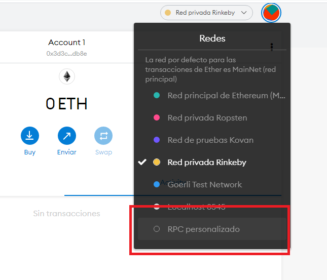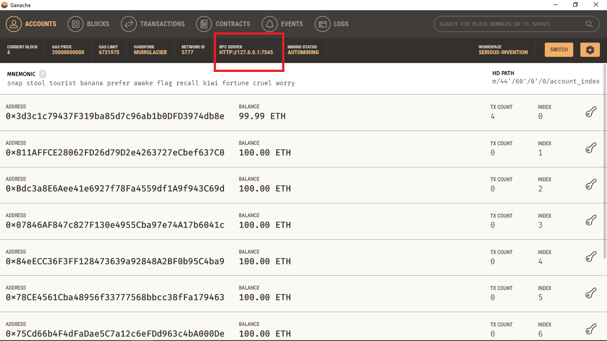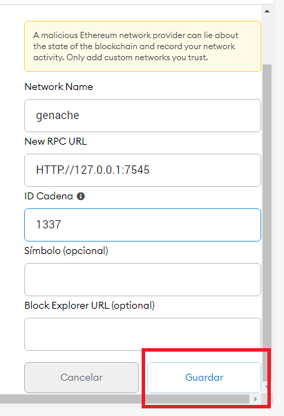

Verificamos la  migracion exitosa como se muestra a continuacion, ya que aparecera la misma cantidad de eth que tenemos en nuestra cuenta de ganache.

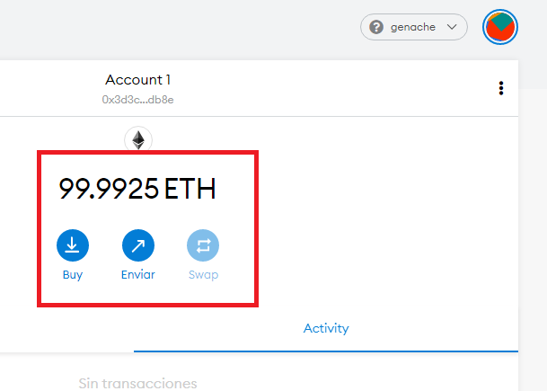

Ahora comenzaremos a implementar lo necesario para nuestra aplicacion web, por lo que instalamos el siguiente comando "npm install -g  create-react-app" y una vez instalado, nos dirigimos al directorio donde tenemos nuestro proyecto y crearemos la carpeta que contendra nuestra app de react con el comando "create-react-app nombreRandomDeLaCarpeta" (aqui ustedes pueden poner que nombre quieren que tenga la carpeta, en este caso sera module-7).

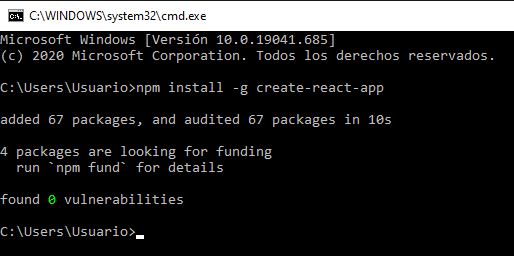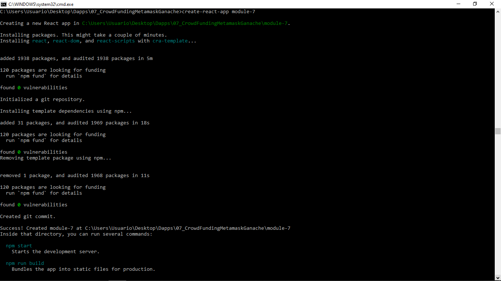

Una vez creada nuestra app por default de React, la ejecutaremos desde la direccion de nuestra carpeta que acabamos de crear mediante el comando "npm start", lo que nos mostrara en nuestro navegador la aplicacion con su frontend por default.

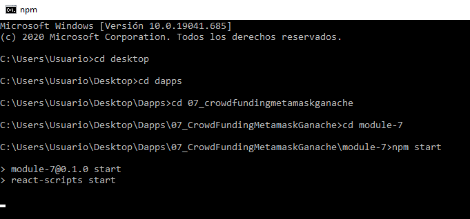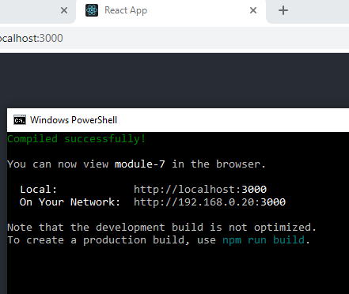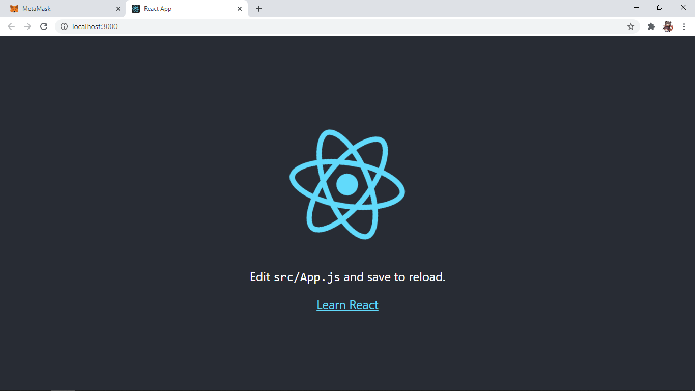

Posteriormente trabajamos en nuestros archivos de frontend al gusto, en este ejercicio pueden observar todos los archivos del frontend, el cual para nuestro ejemplo nos da la siguiente ventana al ejecutar nuevamente el comando "npm start"

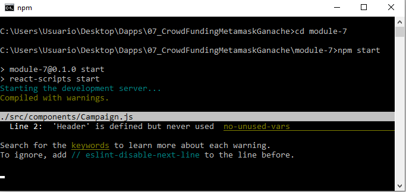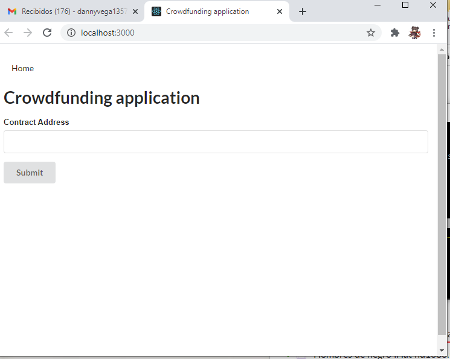

Una vez en nuestra aplicacion pegamos el contact address de nuestro deploy en ganache, y nos mostrara la informacion que contiene ese contrato como se observa a continuacion:

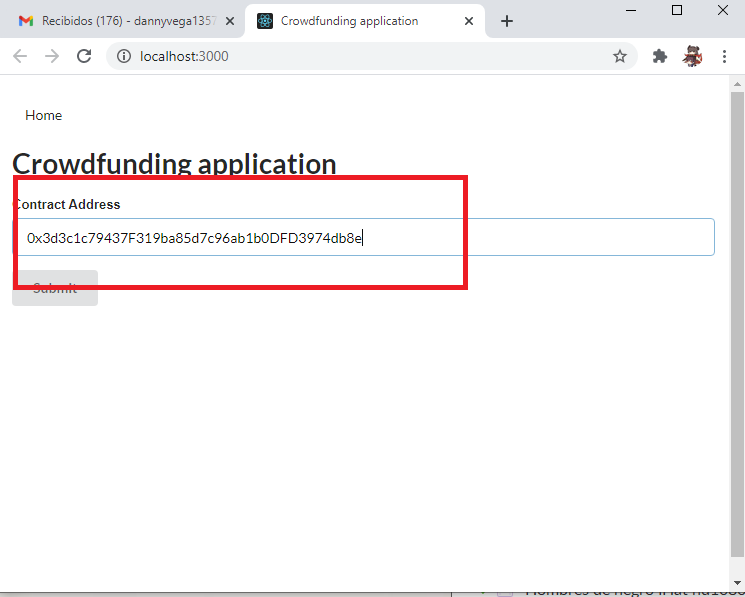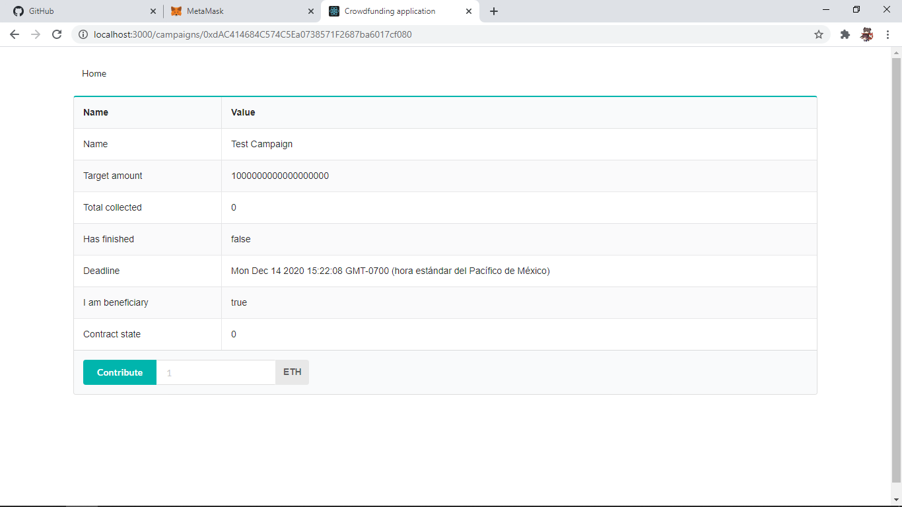

Para finalizar solamente agregamos la cantidad en ETH que quedemos colectar, y al presionar OK veremos como nos muestra que la recoleccion ha finalizado, mientras que en ganache nos mostrara la informacion que contiene dicha transaccion.

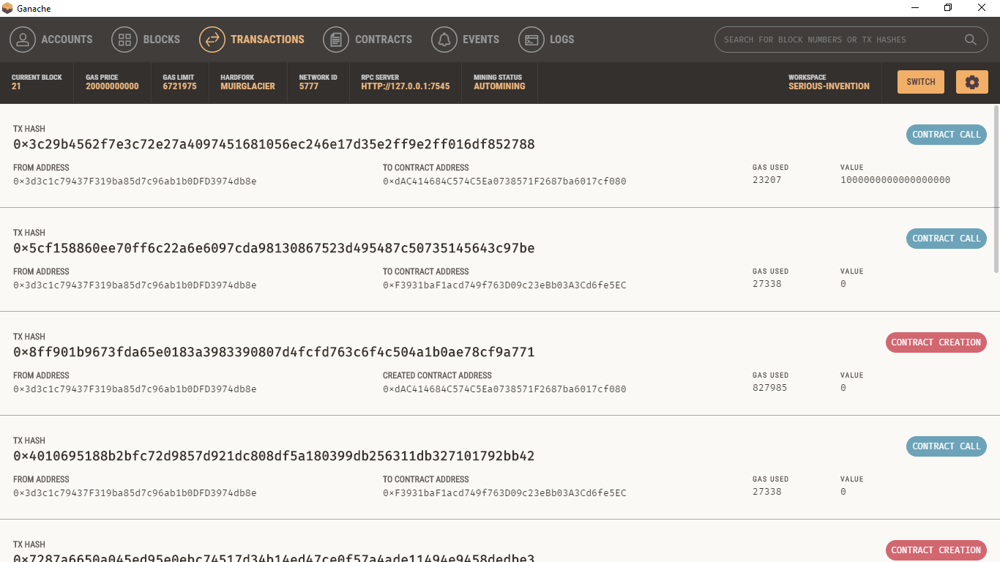